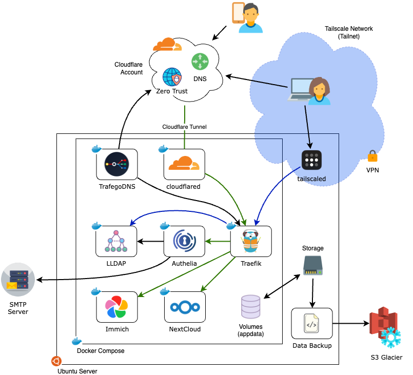

# Selfhost Bootstrap Project

This project will help you bootstrap a simple but powerful home-lab server that can replace services like Google Docs and Google Photos—giving you more control, privacy, and ownership over your data.

- 📂 **Sync your documents across devices and collaborate with others** – using [Nextcloud](https://nextcloud.com/), a versatile platform that replaces Google Docs and Drive. It offers file storage, document editing, calendar sync, and other collaborative tools.
- 📸 **Store, organize, and share your photos and videos** – For photos, you will use [Immich](https://immich.app/), a powerful self-hosted alternative to Google Photos that automatically backs up and categorizes your pictures while giving you full control.
- 👥 **Manage users with access to your self-hosted applications**- Easily add new users (e.g. family or organization members) to your server and grant them access to the applications installed on the server.
- 🌐 **Access your server securely from anywhere** – Set up your own custom domain with [Cloudflare](https://www.cloudflare.com/products/registrar/) and configure secure remote access, so you can get to your data wherever you are.
- 📊 **Monitor your server 24/7** - With pre-installed tools like [Prometheus](https://prometheus.io/), [Loki](https://grafana.com/oss/loki/), and [Grafana](https://grafana.com/oss/grafana/), get a glimpse of your server activity and configure automatic alarms to notify when abnormal conditions are detected.
- 🔄 **Set up encrypted backups to AWS for peace of mind** – with automated, encrypted off-site backups to [AWS S3 Glacier](https://aws.amazon.com/s3/storage-classes/glacier/) storage, to ensure your data is protected in case of hardware failure.



## Pre-requisites

In order to setup your self-hosted solution, you will need to take some preparation steps:

### 1. Server setup: Hardware

You will need to buy or build a server that will host your applications. Review this [document]((docs/hardware.md)) for considerations on CPU/RAM/Storage. 

> 🛠️ If you are participating on the Server Workshop and receiving the pre-built server, you will find details on the [hardware specs](docs/hardware.md#server-workshop-hardware) of your server at the end of the doc.

### 2. Server setup: Operating System

You will need to install a recent distribution of Linux on your new server. I recommend using [Ubuntu Server](https://ubuntu.com/download/server) version 24.04, or whichever is their latest LTS (long-term support) version.

> 🛠️ If you are participating on the Server Workshop and receiving the pre-built server, you do not need to worry about this step. We will be installing Ubuntu Server as part of the workshop.

### 3. Third-party services

Part of our server infrastructure will make use of services offered by third-party providers. The **free tier** offered by these providers will be sufficient to cover the requirements for a server used by a family or small-team.

Follow the guides linked below to setup your account and obtain an **API Key** for each of the following providers:

1. **[Cloudflare](docs/cloudflare.md)**- An account and domain registered with Cloudflare. We will also use their DNS and Zero Trust Tunnel services which are included in their FREE tier. Follow the steps in [this document]((docs/cloudflare.md)) to get your account properly setup.
2. **[Tailscale](docs/tailscale.md)**- An account registered with Tailscale. We will create a VPN mesh network (Tailnet) to remotely access our server for administration. Follow the steps in [this document]((docs/tailscale.md)) to get your account properly setup.
3. **[SMTP2GO](docs/smtp.md)**- Some of the apps in this project use SMTP to send automated emails (e.g. for password recovery). Follow the steps in [this document]((docs/smtp.md)) to get a free account setup with SMTP2GO. If you prefer to use a different SMTP provider, you can add the flag `--custom-smtp` when running the setup script and provide the values for your SMTP server address, port, username and password as part of the installation script.

> 🛠️ If you are participating on the Server Workshop, make sure to complete the steps above before the day of the workshop. You will need to provide the **API Key** that was obtained for each of the providers above.

### 4. Personal device setup (PC/Laptop)

To setup the server from your personal device, I recommend installing the following software:

1. **Tailscale**- You should have already done this as part of setting up your Tailscale account. If not, follow the steps on [this section of the doc](docs/tailscale.md#2-install-tailscale-on-personal-devices).
2. **SSH Client**- Since our server is a headless device (no monitor or keyboard attached), we will use an SSH client to remotely run commands on the server. I recommend installing [Termius](https://termius.com/). There is a free version for Windows and Mac available.

> 🛠️ If you are participating on the Server Workshop, make sure to install the software linked above on the laptop you will bring to the workshop in advance.

### 5. Gather your existing content from the cloud

If you have content stored in the cloud that you want to make available on your self-hosted apps, you should gather the content on your PC or Laptop in preparation to migrate the content to your server. For example, you may want to migrate documents, photos and videos that are currently scattered across multiple cloud providers, such as Google Photos, Google Docs, iCloud, OneDrive, etc.

[This document]() provides an overview of the steps needed to gather the content, depending on your current cloud provider.

## Server Configuration and Deployment

### 1. Preparing your workspace

1. From your laptop, start a new SSH session on your server.

2. Prepare your workspace (on the server) and download the setup scripts by running the following:

```bash
mkdir -p ~/self-host/workspace
cd ~/self-host/workspace
curl -fsSL https://thedebuggedlife.github.io/selfhost-bootstrap/setup.zip | busybox unzip -n -
chmod +x setup.sh
```

### 2. Choose which modules to enable

The installation script is structured using a modular approach. It gives you the ability to pick and choose which modules you want to enable on your server. You can run the setup script with the `--help` option to view a list of modules available:

```bash
./setup.sh --help
```

You can also find more information on the available modules in [this document](docs/modules.md).

👉 If you are participating on the Server Workshop, I would recommend installing all modules available and try each of the tools and applications provided by these modules before deciding if you would like to keep them installed or removed. Modules can be easily added or removed at any point using the same setup script.

### 3. Deploy the selected modules

You can deploy modules to your server using the setup script. There are a few different modes in which you can run the script:

#### Setup Mode: Interactive with safe defaults (recommended)

If you would like to accept the safe defaults provided with the script, you can run it with the `--resume` option. This will skip the prompts for configuration values that have a safe default associated with them. 

```bash
./setup -m all --resume
```

For more information, see: [optional settings](docs/overrides.md#optional-settings)

#### Setup Mode: Fully interactive

In this mode, the setup script will ask you to provide and confirm all configuration options available for each of the applications that will be installed on the server:

```bash
./setup.sh -m all
```

#### Setup Mode: Unattended

In this mode, you provide all necessary information inline, when invoking the script. The process of installing and configuring the server will proceed without any intervention needed:

```
# Acquire sudo in the current session to avoid further prompts by the script
sudo -v
# Invoke the script providing all required overrides
./setup -m all --unattended \
    -o TAILSCALE_API_KEY=... \
    -o CF_DNS_API_TOKEN=... \
    -o CF_DOMAIN_NAME=... \
    -o SMTP2GO_API_KEY=... \
    -o ADMIN_USERNAME=... \
    -o ADMIN_EMAIL=... \
    -o ADMIN_PASSWORD=... \
    -o "ADMIN_DISPLAY_NAME=..."
```

In this mode, you can provide additional environment overrides to configure the applications installed by the script. See [this document]() for details on all available overrides.

#### :warning: Important:

The first time you deploy a service to your server, it will take several minutes for all of them to be accessible behind your domain (e.g. https://immich.example.com)

## Modules

The project is structured using a modular approach where services are grouped into logical modules that can be installed independently (with some exceptions). This design provides flexibility, allowing you to install only the services you need while maintaining a cohesive environment.

In the examples shown earlier, the script will install all available options because we used the option `-m all` when calling the setup script. You can, however, select only a subset of modules to install to the server. 

For example, the following will only install Immich, Nextcloud and tools to monitor the server remotely:

```bash
./setup.sh -m immich -m nextcloud -m monitoring --resume
```

For more information on which modules are available and what each of them provides, see [this document](docs/modules.md).

## User Management

==TBD==