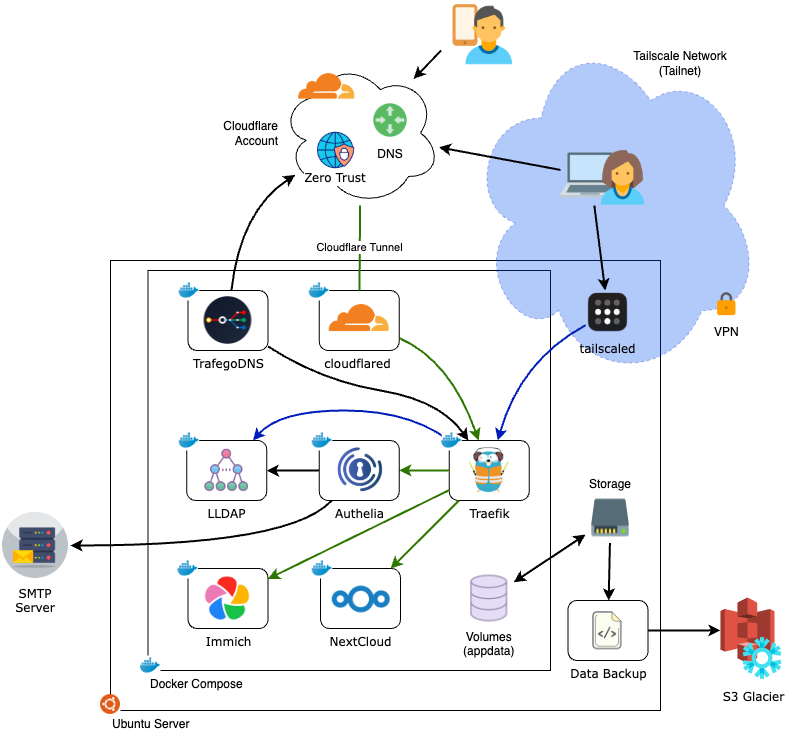

# Project: Base + Immich + NextCloud

This project will help you bootstrap a simple but powerful home-lab server that can replace services like Google Docs and Google Photos—giving you more control, privacy, and ownership over your data.

- 📂 **Self-host your documents and collaborate** – We’ll use [Nextcloud](https://nextcloud.com/), a versatile platform that replaces Google Docs and Drive. It offers file storage, document editing, calendar sync, and other collaborative tools.
- 📸 **Store, organize, and share your photos securely** – For photos, we’ll set up [Immich](https://immich.app/), a powerful self-hosted alternative to Google Photos that automatically backs up and categorizes your pictures while giving you full control.
- 👥 **Manage users with access to your self-hosted applications**- Easily add new members to your server and grant them access to Immich or Nextcloud.
- 🌐 **Access your server securely from anywhere** – We’ll guide you through the process of setting up your own custom domain with [Cloudflare](https://www.cloudflare.com/products/registrar/) and configuring secure remote access, so you can get to your data wherever you are.
- 🔄 **Set up encrypted backups to AWS for peace of mind** – We’ll configure automated, encrypted off-site backups to [AWS S3 Glacier](https://aws.amazon.com/s3/storage-classes/glacier/) storage to ensure your data is protected in case of hardware failure.



## Pre-requisites

In order to setup your self-hosted solution, you will need to take some preparation steps:

1. **[Hardware](docs/hardware.md)**- Buy and/or build a server to host your applications. Review this [document]((docs/hardware.md)) for some recommendations.
2. **Linux**- A recent distribution of Linux. I recommend installing [Ubuntu Server](https://ubuntu.com/download/server) version 24.04 (or latest LTS)
3. **SSH Client**- A computer with an SSH client that we can use to connect to your server for administration. I recommend installing [Termius](https://termius.com/) on your laptop - there is a free version for Windows and Mac available.
4. **[Cloudflare](docs/cloudflare.md)**- An account and domain registered with Cloudflare. We will also use their DNS and Zero Trust Tunnel services which are included in their FREE tier. Follow the steps in [this document]((docs/cloudflare.md)) to get your account properly setup.
5. **[Tailscale](docs/tailscale.md)**- An account registered with Tailscale. We will create a VPN mesh network (Tailnet) to remotely access our server for administration. Follow the steps in [this document]((docs/tailscale.md)) to get your account properly setup.
6. **[SMTP](docs/smtp.md)**- Some of the apps in this project use SMTP to send automated emails (e.g. for password recovery). Follow the steps in [this document]((docs/tailscale.md)) to get a free account setup with SMTP2GO, or add the flag `--custom-smtp` when running the setup script.

## Configuration and Deployment

Prior to running the script, make sure you have the following available:

- Your Tailscale API key ([see how to get it](docs/tailscale.md))
- Your Cloudflare API key ([see how to get it](docs/cloudflare.md))
- Your SMTP2Go API Key ([see how to get it](docs/smtp.md)) -OR- your desired SMTP server login information.

To being deployment:

1. SSH into your server
2. Prepare your workspace and run the setup script as follows:

```bash
mkdir -p ~/self-host/workspace
cd ~/self-host/workspace
wget -qO setup.sh https://raw.githubusercontent.com/thedebuggedlife/selfhost-bootstrap/refs/heads/main/projects/base-immich-nextcloud/setup.sh
chmod +x setup.sh
./setup.sh
```

3. During setup, you will be asked to enter the API keys obtained earlier, as well as some additional configuration options. 

> Many options are pre-configured with default values, shown in between squared braces `[]` which you can accept by pressing `ENTER`.

4. After, the script will install some dependencies and deploy the services.

If the script gets interrupted and you need to restart it, you can add the flag `--resume` to skip all prompts that had been completed in a previous run:

```
./setup.sh --resume
```

:warning: After deploying all services, it will take ~5 minutes for all of them to be accessible behind your domain (e.g. https://immich.example.com)

## Post-Install Steps

After a successful run of the setup script as shown above, you will need to take a few steps to finish setting everything up:

1. Get an Immich API Key ([see how to get it](./docs/immich.md#getting-an-api-token)).
2. Run the bootstrap script:

```
cd ~/self-host/workspace
./setup.sh --post-install
```

3. You will be asked to enter the username, email and password for the primary user of the server, who will also be given server administrator privileges. 
4. You will also be asked for the Immich API key. Follow these steps to log into Immich and get the API Key.

:warning: When creating an account on Immich during first login, use the same username and email you provided for the primary user. **This is very important for things to work properly afterwards!**

🎉 Once the bootstrap script completes, your server is ready to be used!

## User Management

==TBD==