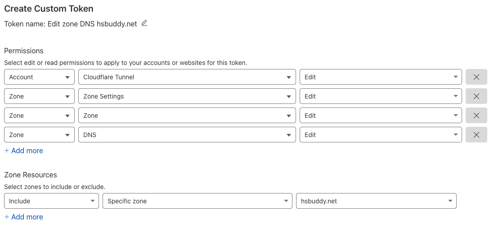

# Cloudflare Account Setup

For this project, we are going to make our self-hosted services available on the internet using [Cloudflare Tunnels](https://developers.cloudflare.com/cloudflare-one/connections/connect-networks/). In order to use Cloudflare Tunnels, you will need to create an account with Cloudflare (if you do not already have one), and have a domain that is managed by Cloudflare. You can migrate your domain from a different DNS provider if you already own one, or you can register for a new domain with Cloudflare.

## Cloudflare Tunnels

Cloudflare Tunnels provide a secure and straightforward way to expose local services—like your HomeSeer server—to the internet without needing to open ports on your router or manage complex firewall configurations. A Cloudflare Tunnel acts as a bridge between your local network and Cloudflare’s network, encrypting traffic end-to-end and hiding your internal services behind Cloudflare’s robust security infrastructure. With Cloudflare Tunnels, there’s no need for traditional port forwarding or exposing your public IP address, significantly reducing the risk of cyberattacks.

Learn more about Cloudflare Tunnels at https://thedebugged.life/direct-access-for-homeseer/

## Step by Step Guide

### 1. Create an account with Cloudflare

Signing up for Cloudflare is free and their free offering gives us access to all the functionality we need to run our home-lab server (except for the domain name).

To create an account, head to: https://dash.cloudflare.com/login

### 2. Register a domain with Cloudflare

> Cheap options for new domains: *.cc, *.work, *.org, *.xyz, *.club, *.vip, *.app

To register a new domain:

- Go to your dashboard **Home**: https://dash.cloudflare.com
- Click on **Register a new domain** (if you don't)
- Follow the rest of the instructions to complete registration of domain

To migrate an existing domain:

- Go to your dashboard **Home**: https://dash.cloudflare.com
- Click on **Add a domain**
- Enter your existing domain and click **Continue** (if you own one)

### 3. Get a token to manage your Cloudflare DNS Zone

We will use this token later during the configuration and deployment phase of the project.

- Go to your dashboard **Home**: https://dash.cloudflare.com
- On the left-hand options, expand **Manage Account** then select **Account API Tokens**
- Click on **Create Token**
- Look for template called **Edit zone DNS** and click on **Use template**
- Edit token name and add your domain at the end (e.g. `example.com`)
- Make sure that **Permissions** include the following (see picture below):
    - **Account** - **Cloudflare Tunnel** - **Edit**
    - **Zone** - **Zone Settings** - **Edit**
    - **Zone** - **Zone** - **Edit**
    - **Zone** - **DNS** - **Edit**
    - Choose your domain under **Zone Resources**

Example:

- Click on **Continue to summary**
- Click on **Create Token**

> #### !! Copy the token and save it somewhere you can access it later !! (e.g. _Notepad_)